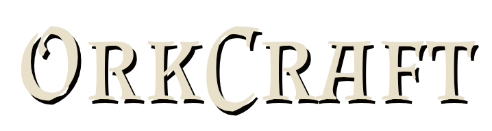
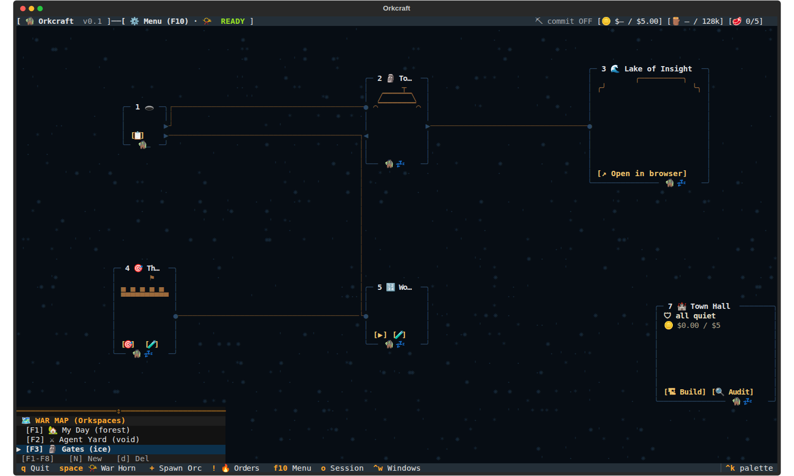
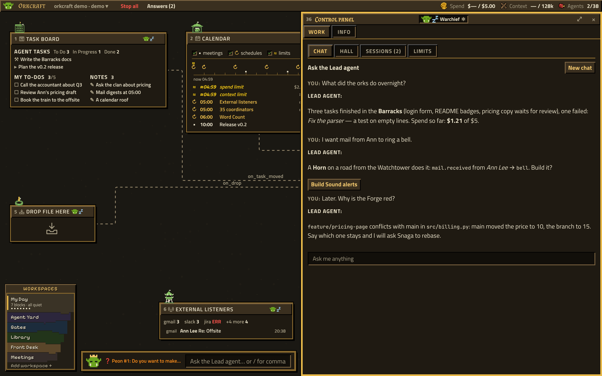
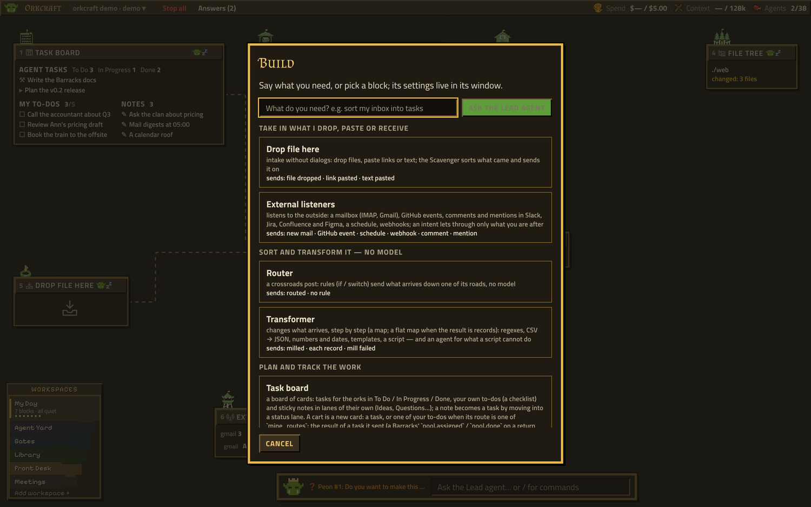
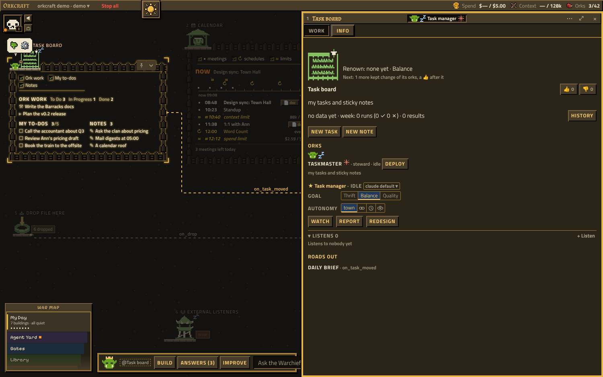
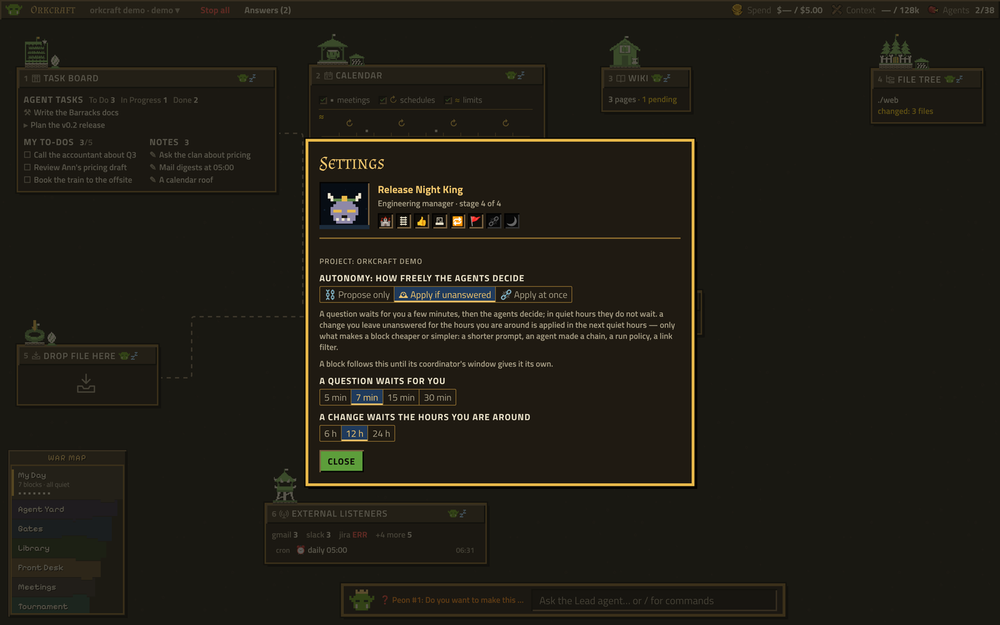

<p align="center">
  <picture>
    <source media="(prefers-color-scheme: dark)" srcset="docs/img/wordmark-dark.png">
    <source media="(prefers-color-scheme: light)" srcset="docs/img/wordmark-light.png">
    
  </picture>
</p>

# Orkcraft

**A harness for running many coding agents in one project — as a real-time strategy game.**

Windows are **buildings** with a resident **ork**. Agents are the **clan**. Buildings send **carts**
to each other along **roads**. The HUD shows what you spend. Agents never pop dialogs: when one
needs you it sets its hut on fire 🔥 and waits for your orders, and the **Warchief**, the lead agent
in the line at the town's foot, builds, commands and answers for you.

Orkcraft opens your project as a town in a window. It works in any git project and talks to
models only through the CLIs you already have — [Claude Code](https://claude.com/claude-code) (`claude`),
Google Antigravity (`agy`) and [OpenAI Codex](https://github.com/openai/codex) (`codex`) — so there are no API
keys to configure.



> [!WARNING]
> **Alpha version — it may be unstable.** Orkcraft is under active development: features, settings
> and file formats can change between versions, and some things may break or behave unexpectedly.
> It has ~1,300 tests and is used daily, but try it on projects you have committed or backed up, and
> keep an eye on what the agents do. Issues and ideas are welcome.

## Try it

```bash
pipx install "orkcraft[gui] @ git+https://github.com/Orkcraft/orkcraft"
orkcraft --demo                    # a sandbox with simulated data: nothing real is touched, no model is called
```

In a real project:

```bash
cd your-project
orkcraft hooks install             # session log + the Warder guard in .claude/settings.json (reversible)
orkcraft                           # open the town in a window (macOS: the system's WebKit); gui --browser for a tab
```

> [!NOTE]
> **The terminal UI is deprecated.** `orkcraft tui` still opens it, and `orkcraft` falls back to it
> when the window's packages are missing, but it gets no new features: the town lives in the window
> now ([docs/design/calm-town.md](docs/design/calm-town.md)). On a machine without a display, use
> `orkcraft gui --browser` over a forwarded port.

You need Python 3.11+ and git. Optional: `claude`, `agy` and/or `codex` on your `PATH` (agents; the
Builder needs `claude`), `gh` (GitHub events in the Watchtower).

Worth knowing: `/` or `Ctrl+K` puts you in the Warchief's line (`/build`, `/road`, `/orkspace`, `@a building`,
or just ask) · a right click on a hut or on the bare map has its menu · ↑ / ↓ and Enter walk the War Map ·
**Stop all** in the HUD stops every running agent, script and browser.

## The idea

| In the game | In your project |
|---|---|
| 🏰 **Town** | one map per workflow (an **orkspace**, `F1`–`F8`, each on its own biome), every building a small hut with live status lines |
| 🏗 **Building** | a window: tasks, files, git, a mailbox, a webhook, a chart… |
| 🧌 **Ork** | an agent, a script or a free chain of data steps living in a building |
| 🛤 **Road** | a subscription: what happens in one building travels as a cart to the buildings that listen |
| 🪙 / 🪵 / 🥩 | money, context tokens and running agents — with budgets you set |

Roads are the point. A building never needs to know who listens to it; the listener decides
what to do with each cart. The cheapest thing that works wins: a plain road, then a **chain**
(data steps, no model), then a **script**, and only then an **agent**.

## The camp

The catalog, each building with its own events and settings — and a custom one the Builder writes for you:

| | |
|---|---|
| **Intake and routing** | 🕳️ Pit (drop files, paste links) · 🗼 Watchtower (mail and Gmail, GitHub, comments and mentions in Slack / Jira / Confluence / Figma, schedules, webhooks — one tower, filtered by your intent) · 🚏 Signpost (if/switch routes) · ⚙️ Mill (map / flat map: data steps, an agent where a script can't) · 📯 Horn (a sound of your choice per incoming event) |
| **Queues and work** | 🌾 Task Fields (a board of tasks and sticky notes) · 🏕️ Barracks (agents in parallel, a branch per task, reviewed by its steward; a PR for code and what goes out) · 🪔 Clan Fire (the clan reviews a document from every side; the steward lets it go or sends it back) · 🥁 War Drum (your calendar; agents prepare documents for meetings ahead of time) |
| **Storage, code, inspection** | 🌲 File Forest · 🗑️ Scroll Dump (an LLM wiki its ork keeps from your notes, code, git and Confluence) · 🌊 Lake of Insight (diffs, Markdown; edit a file in place — your notes right in the text — with autosave) · ⚒️ Forge (tests a branch in a throw-away worktree, squash-merges) |
| **Results and egress** | 📦 Loot Vault (the review checkpoint: carts pass by rules or wait for you; send back for rework, see what the chain cost) · 🪨 Tally Crag (spend, tokens, load as bars) · 🎯 Catapult (waits for several roads, checks a JSON Schema, sends over HTTP — or, where there is no API, its ork finds the forms of an intent and fills them in a browser) |

## The Town Hall

The 🏰 Town Hall is where the town changes. Everything goes through it, and everything it does is
a commit in the camp's own git, so it can be undone.



- **🏗 Build** — `/build` or a right click on the map: say what you need, or pick a block from the
  catalog and it stands where you clicked. No model call for a block from the catalog.

  
- **🛠 New** — ask the Warchief for what the catalog lacks: the **Builder** asks what the building
  should do and writes a **script** (a model only where a script cannot do the job). The blueprint is
  previewed, reviewed by the Council and run on mock carts in a sandbox before you approve it.
- **🏛 The Council** reviews what is made from scratch — 👑 Chief (budget), 🧱 Mason (schemas),
  🎨 Artisan (the screen and your cognitive load), 🛡 Warder (shell commands, prompts, secrets),
  ⛏ Peon (worktrees, permissions, housekeeping). Rules first; a light model (`haiku`) adds opinions.
- **🛤 Roads with a prompt** — pick a source and its events, say in words what to do with each
  cart; a chain or a script is made unless the rule really needs judgement.
- **👍 / 👎** beside every steward. A 👎 asks whether the *inputs* were broken (the buildings that
  fed it are penalised upstream along the roads) or its own *logic* was wrong.
- **You teach it by working.** What you do with a result counts as well, with a smaller weight: a cart
  accepted, edited or sent back in a 📦 Loot, an ork's file whose format you changed in a 🌊 Lake
  (filling it in does not count against it), a pull request merged or closed, a change taken back
  with `Z` — and a result nobody opens tells the Town retro the building may be unused.
- **Retros, never automatic.** Daily, the 🔧 Building retro proposes one change for the building
  that eats most of the camp and of your limit and that you are unhappy with; weekly, the 🗓 Town
  retro has a heavy model (`opus`) audit the whole camp. Nothing
  applies without your click, each change is a checkpoint, and one building can be taken back on its own.

## Growth

Buildings and their operator grow, from what the orks learned — never from clicks
([docs/design/growth.md](docs/design/growth.md)).

- **🚩 Renown I–III.** A building earns it from the changes of its orks that passed probation and
  what you liked since; it never drops. It shows as a flag on its roof (ivory at I, taller at II,
  gold at III) and the stones it stands on, a course more at each level. Its **goal** (🪙 thrift ·
  ⚖️ balance · 💎 quality) shows as an annex beside it from the start: a lean-to over logs, none, a
  crystal. Info says what the next level asks.

  
- **Your mascot.** Settings opens with you: the mascot of the role you gave in the onboarding (an
  ork, a lich, an elf…), four stages from a Zombie Manager to a Night King, and your **deeds** — the
  first road, the first change the orks kept, a building at III; the ones ahead are grey with a hint.

  
- **The Warchief says what grew** — a level, a deed, and the loop closed on your review ("your 👎 on
  Brief → the orks changed it → 4 👍 since"). He wears the crown; the clan stays green.
- **The War Map.** The orkspaces are lands in a framed map at the bottom left, each in its biome
  (dirt, forest, ice, dust, void, lava, meadow — the ground and the huts follow it, with the TUI's glyphs on
  the ground), the open one tall with its status; the fog of war makes a new one. When an ork asks
  in another orkspace, the map calls you with rings, as a strategy game does when your units are
  attacked ([docs/design/war-map.md](docs/design/war-map.md)).

## Safety

- **Your CLIs, your login.** Models are called as `claude -p …` / `agy --print …` / `codex exec …`. Orkcraft has no
  API keys, accounts or servers, and sends nothing anywhere on its own. A building talks to the
  network only if you configure it to (Watchtower, Catapult, Lake with a URL).
- **Usage stats are off until you say yes.** The window asks once; if you agree, a short list of
  anonymous feature counts is shared — never code, prompts, paths or names
  ([docs/usage-stats.md](docs/usage-stats.md)). `orkcraft usage off` stops it, and `DO_NOT_TRACK=1` always does.
- **🛡 Warder** is a Claude Code and Codex `PreToolUse` hook (`orkcraft hooks install`): it denies catastrophic or
  secret-leaking calls (`rm -rf /`, `curl … | sh`, reading `.env` / `.ssh`, force-push…) and asks
  about destructive ones (Codex cannot ask yet, so there it denies and says why). Codex runs a project's
  hooks once you trust them with `/hooks`. `agy` has no such hook.
- **Scripts** run as `python3 -I` or `bash` with no shell interpolation and a timeout; the Builder's
  sandbox uses an empty folder and a bare environment. Handler scripts run only after review and are
  held again if the file changes.
- **Personal nodes** (Markdown with `subtype: personal` in its front matter) never reach a model.
- **Budgets** — 🪙 per session, 🪵 context — stop model calls; 🛑 Halt All stops everything.

Orkcraft is alpha software that runs agents on your machine. Read what a building does before you
let it loose, and keep the Warder on.

## Where things live

Inside the project it runs in, orkcraft keeps only local state (add these to your `.gitignore`):

- `.orkcraft.json` — the Town Scroll: canvases, buildings, roads, garrisons, budgets
- `.orkcraft/` — logs, sessions, per-building state and **the camp's own git** (branch `camp`) that
  tracks building specs, scripts and blueprints; `Z` reads it. It is separate from your project's history.

Environment variables are `ORKCRAFT_*` (`ORKCRAFT_CLAUDE_BIN`, `ORKCRAFT_AGY_BIN`, `ORKCRAFT_CODEX_BIN`, `ORKCRAFT_LIMITS=0`,
`ORKCRAFT_LAYOUT_FILE`, `ORKCRAFT_COUNCIL_LLM=0`…). Models and schedules of the Council and the
Elders' limits are set in the Town Hall and stored in `.orkcraft/council/settings.json`; you, your
role, mascot and deeds are per machine in `~/.config/orkcraft/settings.json`.

The full reference — every key, building, file format and flow — is in [docs/reference.md](docs/reference.md);
the design of roads and orks is in [docs/design/roads-and-orks.md](docs/design/roads-and-orcs.md).
What is planned next is in [docs/roadmap.md](docs/roadmap.md).

## Development

```bash
git clone https://github.com/Orkcraft/orkcraft && cd orkcraft
python3 -m venv .venv && .venv/bin/pip install -e ".[dev]"
.venv/bin/pytest -q -n auto        # ~1,300 tests in parallel; the GUI's are driven in Chromium, the TUI's headlessly
.venv/bin/orkcraft --demo
```

Every pull request and every push to `main` runs the tests on GitHub Actions (`.github/workflows/tests.yml`).

```
orkcraft/
  app.py, cli.py     the app (it composes tui/) and the command line
  core/              the town without a face: state, services, the bus (no Textual)
  tui/               the app's parts, one domain each: roads, sessions, council, retros…
  gui/               the GUI face: host and server over the core, the page (Preact, no build step)
  design/            tokens, the building UI contracts; design/system → design-system/ (the GUI's CSS, fonts, sprites)
  tools/             the sprites drawn from code (logo.py, growth_sprites.py), the gallery and landing captures
  wm/                the window manager: town, huts, roads, ghost
  screens/           modals and the typed views of every building (screens/typed/)
  realm/             the logic: catalog, roads, chains, council (fastpath), workshop, blueprint,
                     feedback, optimize, weekly, checkpoint, housekeeping…
  quota/             claude / agy quota readers (answered locally, no quota spent)
  sources/ hooks/    sessions, telemetry, limits; the Claude Code and Codex hooks
  demo/              the showcase sandbox
```

## License

Apache License 2.0 — see [LICENSE](LICENSE) and [NOTICE](NOTICE). Copyright 2026 Vadim Sidoryk.

The fonts bundled in `design-system/fonts/` — Almendra SC, Titillium Web, JetBrains Mono and Pixelify
Sans — are under the SIL Open Font License 1.1; their licences sit beside them.
