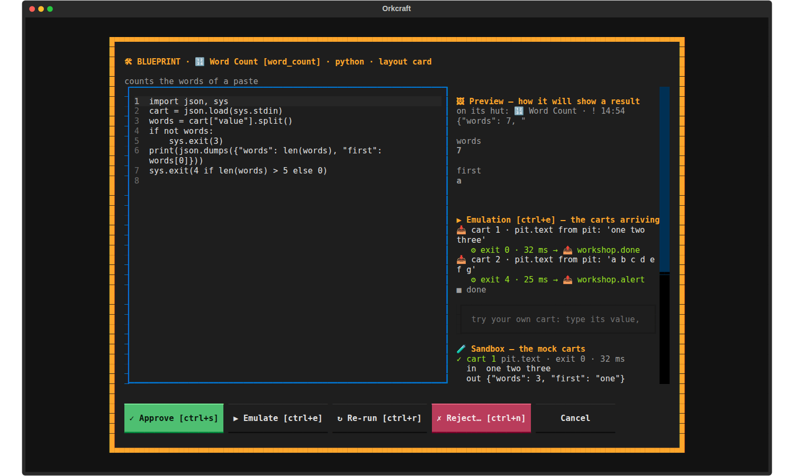

# Orkcraft

**A terminal harness for running many coding agents in one project — as a real-time strategy game.**

Windows are **buildings** with a resident **orc**. Agents are the **clan**. Buildings send **carts**
to each other along **roads**. The HUD shows what you spend. Agents never pop dialogs: when one
needs you it sets its hut on fire 🔥 and waits for your orders.

Orkcraft is a [Textual](https://textual.textualize.io/) app. It works in any git project and talks to
models only through the CLIs you already have — [Claude Code](https://claude.com/claude-code) (`claude`) and
Google Antigravity (`agy`) — so there are no API keys to configure.


> **Status: alpha.** It is used daily and has ~500 tests, but expect rough edges and changes.
> Issues and ideas are welcome.

## Try it

```bash
pipx install git+https://github.com/VadimSidoryk/orkcraft
orkcraft --demo                    # a sandbox with simulated data: nothing real is touched, no model is called
```

In a real project:

```bash
cd your-project
orkcraft hooks install             # session log + the Warder guard in .claude/settings.json (reversible)
orkcraft                           # open the town
```

You need Python 3.11+ and git. Optional: `claude` and/or `agy` on your `PATH` (agents and the
Builder), `gh` (GitHub events in the Watchtower).

Keys worth knowing: `F10` menu · `?` all keys · `B` build · `P` presets · `Y` road · `K` / `F` 👍 / 👎 ·
`Z` revert a building · `space` or `ctrl+p` 📯 War Horn (halts every running agent).

## The idea

| In the game | In your project |
|---|---|
| 🏰 **Town** | one canvas per workflow (`F1`–`F8`), every building a small hut with live status lines |
| 🏗 **Building** | a window: tasks, files, git, a mailbox, a webhook, a chart… |
| 🧌 **Orc** | an agent, a script or a free chain of data steps living in a building |
| 🛤 **Road** | a subscription: what happens in one building travels as a cart to the buildings that listen |
| 🪙 / 🪵 / 🥩 | money, context tokens and running agents — with budgets you set |

Roads are the point. A building never needs to know who listens to it; the listener decides
what to do with each cart. The cheapest thing that works wins: a plain road, then a **chain**
(data steps, no model), then a **script**, and only then an **agent**.

## The camp

Sixteen buildings, each with its own events and settings:

| | |
|---|---|
| **Intake and routing** | 🕳️ Pit (drop files, paste links) · 🗼 Watchtower (mail, GitHub, schedules, webhooks) · 🗿 Totem (if/switch routes) · ⚙️ Mill (data steps, no model) · 🎺 Bugle (a sound of your choice per incoming event) |
| **Queues and work** | 🌾 Task Fields (kanban) · 🏕️ Barracks (agents in parallel git worktrees) · 🔥 Orc Council (agents that debate to a decision) · 🥁 War Drum (your calendar) |
| **Storage, code, inspection** | 🌲 File Forest · 🗑️ Scroll Dump (your notes, retrieved by budget) · 🌊 Lake of Insight (diffs, Markdown) · ⚒️ Forge (tests a branch in a throw-away worktree, squash-merges) |
| **Results and egress** | 📦 Loot Vault (generated files to accept or roll back) · 🪨 Tally Crag (spend, tokens, load as bars) · 🎯 Catapult (waits for several roads, checks a JSON Schema, sends over HTTP) |

## The Town Hall

The 🏰 Town Hall is where the town changes. Everything goes through it, and everything it does is
a commit in the camp's own git, so it can be undone.


- **📜 Preset** — pick what you need, name it, place it with a ghost that follows the mouse. No model call.
- **🛠 New** — talk to the **Builder**: it asks what the building should do, offers three views, and
  writes a **script** (a model only where a script cannot do the job). The blueprint is previewed,
  reviewed by the Council and run on mock carts in a sandbox before you approve it.

  
- **🏛 The Council** reviews what is made from scratch — 👑 Chief (budget), 🧱 Mason (schemas),
  🎨 Artisan (the screen and your cognitive load), 🛡 Warder (shell commands, prompts, secrets),
  ⛏ Peon (worktrees, permissions, housekeeping). Rules first; a light model (`haiku`) adds opinions.
- **🛤 Roads with a prompt** — pick a source and its events, say in words what to do with each
  cart; a chain or a script is made unless the rule really needs judgement.
- **👍 / 👎** beside every steward. A 👎 asks whether the *inputs* were broken (the buildings that
  fed it are penalised upstream along the roads) or its own *logic* was wrong.
- **Self-improvement, never automatic.** Daily, the Council proposes one change for the hungriest
  building you are unhappy with; weekly, a heavy model (`opus`) audits the whole camp. Nothing
  applies without your click, each change is a checkpoint, and **`Z`** reverts one building.

## Safety

- **Your CLIs, your login.** Models are called as `claude -p …` / `agy --print …`. Orkcraft has no
  API keys, accounts or servers, and sends nothing anywhere on its own. A building talks to the
  network only if you configure it to (Watchtower, Catapult, Lake with a URL).
- **🛡 Warder** is a Claude Code `PreToolUse` hook (`orkcraft hooks install`): it denies catastrophic or
  secret-leaking calls (`rm -rf /`, `curl … | sh`, reading `.env` / `.ssh`, force-push…) and asks
  about destructive ones. It guards Claude Code sessions only — `agy` has no such hook.
- **Scripts** run as `python3 -I` or `bash` with no shell interpolation and a timeout; the Builder's
  sandbox uses an empty folder and a bare environment. Handler scripts run only after review and are
  held again if the file changes.
- **Personal nodes** (Markdown with `subtype: personal` in its front matter) never reach a model.
- **Budgets** — 🪙 per session, 🪵 context — stop model calls; 📯 the War Horn halts everything.

Orkcraft is alpha software that runs agents on your machine. Read what a building does before you
let it loose, and keep the Warder on.

## Where things live

Inside the project it runs in, orkcraft keeps only local state (add these to your `.gitignore`):

- `.orkcraft.json` — the Town Scroll: canvases, buildings, roads, garrisons, budgets
- `.orkcraft/` — logs, sessions, per-building state and **the camp's own git** (branch `camp`) that
  tracks building specs, scripts and blueprints; `Z` reads it. It is separate from your project's history.

Environment variables are `ORKCRAFT_*` (`ORKCRAFT_CLAUDE_BIN`, `ORKCRAFT_AGY_BIN`, `ORKCRAFT_LIMITS=0`,
`ORKCRAFT_LAYOUT_FILE`, `ORKCRAFT_COUNCIL_LLM=0`…). Models and schedules of the Council are set in
the app (F10 → ⚙) and stored in `.orkcraft/council/settings.json`.

The full reference — every key, building, file format and flow — is in [docs/reference.md](docs/reference.md);
the design of roads and orcs is in [docs/design/roads-and-orcs.md](docs/design/roads-and-orcs.md).

## Development

```bash
git clone https://github.com/VadimSidoryk/orkcraft && cd orkcraft
python3 -m venv .venv && .venv/bin/pip install -e ".[dev]"
.venv/bin/pytest -q                # ~500 tests; the UI tests drive a real Textual app headlessly
.venv/bin/orkcraft --demo
```

```
orkcraft/
  app.py, cli.py     the app and the command line
  wm/                the window manager: town, huts, roads, ghost
  screens/           modals and the typed views of every building (screens/typed/)
  realm/             the logic: catalog, roads, chains, council (fastpath), workshop, blueprint,
                     feedback, optimize, weekly, checkpoint, housekeeping…
  quota/             claude / agy quota readers (answered locally, no quota spent)
  sources/ hooks/    sessions, telemetry, limits; the Claude Code hooks
  demo/              the showcase sandbox
```

## License

Apache License 2.0 — see [LICENSE](LICENSE) and [NOTICE](NOTICE). Copyright 2026 Vadim Sidoryk.
