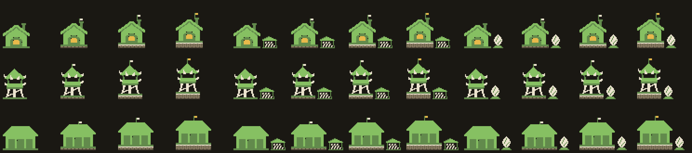
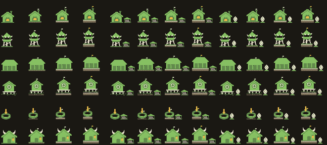
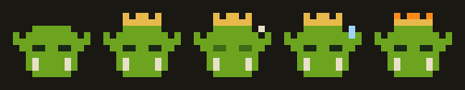

# Design — growth: buildings that mature, a mascot that grows, a crowned Warchief

Status: design notes, written 2026-10-06; stages 1–5 are implemented (`realm/growth.py`,
`gui/growth.py`, `tools/growth_sprites.py`, the crown in `tools/logo.py`). The sketches in
`docs/img/growth/` came first; the sprites in `design-system/sprites/` are the ones shown. Builds on the goals and retros
(docs/design/retros-and-goals.md), the 👍 / 👎 and quiet signals of `realm/feedback.py`, the orks'
changes and their probation (`realm/evolution.py`), the profile of the onboarding
(docs/design/onboarding.md §3) and the flat sprite set (docs/design/building-sprites.md). Wording: ork,
orkestration (CLAUDE.md).

**One look.** The GUI has one look, Office in Camp's theme (gui-design-system.md: the sprites, the
agents' heads and the gold stay). Everything here is drawn in that look. "Office" below means only
the **Office words** (`modes.OFFICE`, `say()`): the same art, the concepts by their Office names, and
no Camp-only jokes (mascot names, the Warchief's address).

| stage | what | state |
|---|---|---|
| 1 | the feedback loop closed: "your 👎 led to this" (§3) | done |
| 2 | a building's level I–III and its goal flag on the roof (§4, §5) | done |
| 2b | the renown as a flag and a footing, the goal as an annex (§5) | done |
| 3 | the Info panel's large header with the level (§6) | done |
| 4 | the Warchief's crown (§8) | done |
| 5 | the operator's mascot grows, in the head of Settings, with deeds (§7) | done |
| later | what a level unlocks by goal (§4.4); temporary moods of the mascot (§7.5) | |

## As built

- **Words.** A building's level is its **Renown** (Office: *Maturity*), shown as "💎 II"; the
  operator's milestones are **deeds** (Office: *milestones*); the goal flag is a **banner** (Office: *goal
  mark*); the mascot is the Office's *avatar* (`realm/lexicon.py`).
- **The clock.** `gui/growth.py` settles once a minute, and at the next tick after a rating, a change
  of the orks or a road (`bus.HALL`, `bus.ROADS`). The first look on a machine records the deeds and the
  stage already reached without saying them.
- **News** waits in `.orkcraft/growth.json` and is said by the Warchief's line after an ork's question
  and before the spend: a click opens the building's Info (a level, a loop) or Settings (a stage, a deed),
  ✕ marks it seen. At most one loop a day.
- **The stage marks** are shared by the kins: a dark-green band (2), ivory horns (3), and at 4 the eyes
  glow gold and a gold gem sits on the band. Never a crown.
- **Stored** per machine as `settings.growth`: `{"stage": 1–4, "deeds": {id: date}}`.

## 1. Why

The retros and the goals learn from the operator's ratings, and the operator rarely rates
(retros-and-goals.md §1: "👍 / 👎 are pressed rarely"). We want more of them, and better ones,
without turning a tool into a game.

The first idea was points: for a written review of a building, for applying a change the steward or
the Warchief proposed, and a rank and an icon bought with them. We are not doing that, because:

- **Points for Apply reward weaker oversight.** Apply is the last guard after the Council and
  probation. A point for pressing it pays the operator to stop reading. A carefully declined bad
  proposal is worth more than an accepted one that nobody read.
- **Points for reviews corrupt the signal.** A review is not engagement. A 👎 penalises suppliers along
  the roads, and its words go into an `enrich` prompt. Reviews written to farm points would degrade
  the prompts (Goodhart).
- **Nobody sees a rank.** Orkcraft has one player, so a number has no audience. A character that
  grows does, because the operator grows attached to it.

What we do instead: show what a review led to (§3), let **buildings mature** from real outcomes (§4),
and let the **operator's mascot grow** with the camp (§7).

## 2. Principles

1. **Growth comes from outcomes, never from clicks.** A level or a stage means the camp got better at
   something: a change survived probation, a building is liked. Nothing a person can press repeatedly
   moves it.
2. **Growth is never lost.** A level or a stage, once reached, stays. Losing one feels like a
   punishment, and people leave a tool that punishes them. What a level allows can still be taken
   back as it is today (probation reverts a change; autonomy stays the operator's to set).
3. **Calm.** There are no XP bars, no numbers on the map, no "Level up!" dialogs and no confetti.
   Growth shows where a picture already is (the hut's header, the head of Settings) and in one line
   in the Warchief's line. The HUD gets nothing new; only Orders burns there.
4. **One art system.** Growth is drawn by **adding** a few pixels to the existing sprites, never by
   redrawing them: the same five colours, the same pixel. Overlays are drawn from code grids (like
   `tools/logo.py`), so they come out identical every time and never drift the way an image model does.
5. **Office words say the same facts plainly:** the art stays (it is the one look), the words change:
   *Level* is *Maturity*, the mascot's name is its role ("Engineering manager · stage 3").

## 3. The feedback loop closed

The cheapest step, and first, because it may be enough on its own.

When a change that a rating or a review caused has proved itself, the operator is told once, in the
Warchief's line:

```
🧌 Your 👎 on Brief (Tue) → the Building retro rewrote its prompt (Wed) → this week 4 👍, 0 👎.
```

- **Its source** is an incident or a review in `.orkcraft/feedback/`, the change it fed
  (`evolution.Change`, matched by building and time, or by the retro's own record of what it read), and
  that change's outcome after probation (`kept`), with the ratings since.
- **When:** after the change is `kept`, and when at least one rating came after it, or after 7 days
  without one. A reverted change says so too ("…was taken back, Brief keeps its old prompt"), because
  that is also an answer to the operator's review.
- **Written reviews** that went into an `enrich` prompt are named: "your note 'too long, skip the
  commit list' is now in Brief's instructions".
- **Never more than one** such line a day; the rest wait.

**Metric:** the share of buildings with at least one rating in a week, and how often the Town retro
still has to show its survey (retros-and-goals.md §4). If stage 1 alone moves them, stages 2–5 are
about delight, not about data.

## 4. A building's level

### 4.1 One level per building, the goal is its direction

A building has a **level**: none, I, II or III. The level measures **maturity**: how well the orks in
it have learned to work the way the operator wants. It does not depend on the goal. The **goal**
(🪙 Thrift · ⚖️ Balance · 💎 Quality) gives the level its direction, and it shows as an **annex** beside
the building (§5).

- Changing the goal changes the annex and keeps the level. No progress is kept per goal, so
  trying another goal costs nothing.
- ⚖️ Balance, the default, grows like the others. Most buildings are on it, and a town where they
  never grew would never show growth.

### 4.2 How a level is earned

The counts are starting values, to be calibrated on real camps (as retros-and-goals.md stage 5).

| Level | When (all of the row) |
|---|---|
| I | one change of the orks to this building `kept` after probation · liked weight ≥ `ENOUGH` since it |
| II | three kept changes · liked weight > disliked weight over the last 30 days · no change reverted in the last 14 days |
| III | five kept changes · 30 days without a reverted change · liked weight ≥ 3 × disliked over the last 30 days |

- **Counted changes** are the orks' own (`evolution.Change` from a retro or a steward that passed
  probation). The operator's own edit is `kept` at once with no probation (`evolution.record`), so it
  counts only when a rating of ≥ `ENOUGH` follows it. Otherwise, editing a prompt by hand would be a
  way to farm levels.
- **Weights** are those of `feedback.scores` (`liked`, `disliked`), so quiet signals (a merged pull
  request, an accepted cart in a Loot) count as they do for the retros.
- A level, once reached, stays (§2.2). A building that gets worse shows it as it does today: 👎,
  incidents, fire, a Building retro.
- A demolished building takes its level with it. A rebuilt one starts with none.

### 4.3 What a level means

The level is information, not a decoration: it says which buildings can be trusted.

- **At III, the steward offers one step more of autonomy**, once, in its Report: "Brief has been
  steady for a month. Let it apply its own changes on the clock?" The level **never raises autonomy
  by itself**, and autonomy stays the operator's to set at any level (retros-and-goals.md §3).
- The Building retro may prefer lower-level buildings when two are otherwise equal: a mature one has
  less to gain.

### 4.4 Later: what a level unlocks by goal

If a real branching tree is wanted on top, the level stays shared and the **goal decides what it
opens**, for example 🪙 III: the steward may propose turning the building into a script; 💎 III: it
may propose a reviewer ork for the building's output. This is not in stages 1–5.

### 4.5 Where it lives

- `realm/growth.py` (no face, like all of `realm/`): `level(repo_root, building_id) -> int` computes the
  level from `evolution.load` and `feedback.scores`. `reached(...)` returns the levels that went up since
  the last check.
- The reached level is stored in the Town Scroll as `buildings[].level` (`0`–`3`, missing = `0`) so
  that it never drops when old rows age out of the ledger.
- A level that goes up publishes `growth.level` on the bus (`core/bus.py`). The GUI says it in the
  Warchief's line ("The Forge grew to 💎 II"). The service never shows a toast itself.

## 5. The flag, the footing and the annex



The first version told both in one flag on the roof: its shape the goal, its colour the level. On the map
a hut's sprite was drawn at four ninths, a pixel of it under one screen pixel, so the flag was three
pixels across: its shape could not be read, and the muted cloth of level 0 hardly differed from the
ivory of I. Each building flew one too, so a flag said nothing. Now each thing has a mark of its own:

| | none (0) | I | II | III |
|---|---|---|---|---|
| **flag** on the roof (renown) | none | ivory | a taller pole | gold |
| **footing** under the hut (renown) | none | one course of stones | two courses, an ivory edge | three courses |

| goal | **annex** beside the hut, on the ground at its right |
|---|---|
| ⚖️ Balance | none: the default, so a goal chosen stands out |
| 🪙 Thrift | a lean-to over a stack of logs: kept, counted, reused (wide and low) |
| 💎 Quality | a crystal on a whetstone: cut, polished, checked (tall and narrow) |

- **The renown is said twice.** The footing raises the hut and widens its base, mass that reads at map
  size; the flag says *gold or not*. The annex says the goal at once, from level 0: choosing it is a
  decision the map shows.
- **The annexes differ by silhouette**, wide against tall, not by a detail, so they read at map size. The map draws
  the sprite at two thirds (it was four ninths), so the footing's courses and the flag's height read too.
- **Drawn from code grids** in the flat palette (`tools/growth_sprites.py`): three flags, three footing
  tiles repeated under any width, two annexes; 8 drawings for the 19 buildings. No sprite is redrawn.
  The footing's stones are the road's tan (`#8f8166`) with a darker mortar.
- **The anchor** of the flag is one point per building type, set by hand (`js/icons.js` `FLAG_AT`): a
  script that looks for the roof's highest point puts it on the Town Hall's horn.
- **Gold at III is a deliberate exception** to "one gold accent per building" (building-sprites.md),
  because the gold flag is the reward.
- **Info** says it in words: "💎 II · Quality".



## 6. The Info panel's header

Info is a working panel: garrison, steward, goal, autonomy, roads. There is **no detailed painting**
of the building there. It would push the work down on every open, and a detailed style would not
match the flat set or scale to 19 buildings × 3 levels × 3 goals. Detailed art, if ever, belongs where
it sells a choice once: the Build catalog, the landing page.

What Info gets:

- **The same sprite, larger** (2× or 3×, `@2x` exists, `image-rendering: pixelated`), with its flag.
  This is the 128×64 "Window" size that sprites.md already plans.
- Beside it, one line: **"The Forge · 💎 II"**, and below it one line on the next level: "Next: 2 more
  kept changes, and a month without a revert".
- With Office words the lines read "Maturity: 2 / 3 · Goal: Quality".

## 7. The operator's mascot

### 7.1 Who

The mascot is **the operator**. The onboarding already gives one per role (onboarding.md §3: Burnout Peon,
The Jira Lich, Gradient-Sick Elf, Growth-Hack Gnome, Data-Mining Goblin, Indie Knight, Wandering Skeleton). Today it is
only a name. It gets a face, and the face grows.

### 7.2 Drawn like the ork

A head on the ork mark's grid (`tools/logo.py`: 12×8, flat, no outline, the same palette), one per
kin: ork, undead, elf, gnome, goblin, knight, skeleton. Stages **add** to the head and never redraw
it, the way the ork's states do (sleep mark, sweat, flame):

| Stage | Reached when (starting values) | Its mark on the head |
|---|---|---|
| 1 | the first town is raised | — |
| 2 | 3+ buildings rated in one week | a band |
| 3 | a building reaches level II | horns |
| 4 | three buildings at III, one of them on the clock or unchained | gold eyes and a gem |

The names (`realm/growth.py` `STAGE_NAMES`): a fantasy rank with the job in it. Stage 2 is the role's own
nick from the onboarding, the others are the kin's.

| Kin (roles) | 1 | 2 | 3 | 4 |
|---|---|---|---|---|
| orks (engineers, QA) | Commit Grunt | Burnout Peon · Bug Ork | Hotfix Berserker | Warlord of Prod |
| undead (managers) | Standup Zombie | The Jira Lich · Roadmap Wraith | Lich of Sprints | Release Night King |
| elves (designers) | Pixel Sprout | Gradient-Sick Elf · Lore Elf | Ranger of the Grid | High Elf of the Design System |
| gnomes (ASO, marketing) | A/B Tinkerer | Keyword Gnome · Growth-Hack Gnome | Growth-Hack Artificer | Grand Tinker of Conversions |
| goblins (analysts) | Spreadsheet Scrounger | Data-Mining Goblin | Pivot-Table Boss | KPI Tycoon |
| knights (founders) | Bootstrap Squire | Indie Knight | Knight of the Seed Round | Paladin of Product-Market Fit |
| skeletons (everyone else) | Inbox Skeleton | Wandering Skeleton | Captain of the Skeleton Crew | Lord of a Thousand Tabs |

- **The top stage is never a crown.** The crown is the Warchief's (§8). Each kin has its own top
  mark: glowing eyes and a staff for the lich, a horned war helm for the ork, and so on.
- **The names** keep the onboarding's humour (Jira Lich, Release Night King). They are Camp words; with Office
  words the stage is named by the role and its number ("Engineering manager · stage 3").
- **Art cost:** 7 heads + about 3 stage marks per kin, all from code grids. Start with two kins
  (undead and orks) and 3 stages. The others show a shared stage mark until drawn.

### 7.3 Where it lives: the head of Settings

The mascot has **no place in the HUD**. It heads the Settings dialog (opened from `project ▾`), above
the camp's rules:

```
┌ Settings ─────────────────────────────────────────┐
│ [portrait 48×32]  Jira Lich · stage 3             │
│                   Next: three buildings at III    │
│ 🏰 🛤 🔁 🚩 ░ ░ ░   milestones; grey ones ahead    │
├─ Camp: orkcraft ──────────────────────────────────┤
│ Autonomy: ⛓️ In chains · 🕰 On the clock · …       │
│ …                                                 │
└───────────────────────────────────────────────────┘
```

- **The portrait** is the head at 4× (48×32), `image-rendering: pixelated`, with the name, the stage
  and one line on the next stage.
- **The two parts are told apart:** the head is the operator (per machine), and below it a divider
  names the camp ("Camp: orkcraft") whose rules follow. Otherwise a new project would seem to start the
  operator from nothing.
- **Seen rarely, so it is announced.** A new stage is said once in the Warchief's line, and that line
  is a link that opens Settings on the portrait. The Warchief's address (§7.4) keeps it present
  between visits.
- **A new stage** glows softly the first time Settings opens after it. There is no dialog.
- **Stored** per machine in `~/.config/orkcraft/settings.json` → `growth.stage`, the highest stage
  reached in any camp, and `growth.deeds`: the operator, not the project.
- 🧭 Onboarding, to change the role and so the mascot, is a link under the portrait.

### 7.3.1 Milestones

A row of small marks under the portrait, each what the camp **learned**, never a count:

| | milestone | when |
|---|---|---|
| 🏰 | First town | a town is raised |
| 🛤 | First road | two buildings joined by a road |
| 👍 | First reference | a result kept as what good looks like |
| 🗳 | A week of ratings | three buildings rated in one week (stage 2) |
| 🔁 | It learned | an orks' change kept after probation |
| 🚩 | Mature | a building at III |
| ⛓️‍💥 | Trusted | a building unchained |
| 🌙 | A night's work | the orks worked in quiet hours and their changes were kept |

- **About ten, no more.** No "×100", no streaks, no comparison with anyone.
- **The ones not reached** show as grey silhouettes with a hint ("Join two buildings with a road"), so
  the row also points at what Orkcraft can do that the operator has not tried.
- With Office words they are a plain list, "Milestones".

### 7.4 How the Warchief addresses the operator

With Camp words, the Warchief addresses the operator by the mascot's stage: "My Lord Lich, the Forge
asks for a decision." It is one line of wording with no art, so growth shows in the conversation too.
With Office words there is no address.

### 7.5 Later: moods

The mascot may take a temporary form from the camp's state: asleep (a quiet town), sweating (the
quota is tight, `Camp.tight`), cheering (a pull request merged). A mood passes by itself and never
touches the stage. Any night form must be earned by the **orks** working in quiet hours while the
operator sleeps, never by the operator staying up: the point of Orkcraft is that the clan works at
night.

## 8. The Warchief's crown



Today the Warchief has the same head as every ork in every garrison. A **gold crown** marks the
leader. It is the **role's mark, not a reward**: always there, never grown.

- The grid becomes **12×10** (two rows of crown over the 12×8 head). The Warchief stands slightly
  taller than the other heads, and the badges that hold it are checked for height.
- **Waiting:** the ork's flame sits on the crown of its head, where the crown now is. For the
  Warchief, the **crown's points burn** (alert orange) instead.
- **The product's mark and the favicon stay crownless.** Only the Warchief's line and the Town Hall's
  chat show the crowned head.
- Built by `tools/logo.py` as `sprites/orks/warchief.png` with its states, beside the ork's.
- The Warchief **does not grow and does not take the operator's mascot**: a face that changes every
  month reads as someone else, and two alike faces in the chat blur who speaks.

## 9. Not doing

- Points of any kind: for Apply, for reviews, for logins.
- A rank separate from the mascot.
- Separate sprites per level or per goal (114 drawings, and the style would drift). Copies of a
  building as its level (two towers at II) neither: a camp may already build two of a type, and a
  copy would read as a second building.
- XP bars, numbers on the map, level-up dialogs, the mascot in the HUD.
- Detailed paintings in Info.
- Anything in the TUI: it is deprecated (calm-town.md §9). All of this is GUI only.

## 10. Words

New pairs in `realm/lexicon.py` `TERMS` (Camp word in code, Office word shown with Office words):

| key | Camp | Office |
|---|---|---|
| `level` | Level | Maturity |
| `goal_flag` | Banner | Goal mark |
| `mascot` | Mascot | Profile |
| `renown` | Renown | Maturity |
| `banner` | banner | goal mark |
| `deed` | deed | milestone |
| `fog_of_war` | fog of war | new orkspace |
| `growth.next` | Next | To reach the next level |

Mascot names and the Warchief's address are Camp words only.

## 11. Metrics

| | watches for | healthy |
|---|---|---|
| Buildings rated in a week (share) | stage 1's effect | up |
| Town retro survey shown | ratings are still missing | down |
| Proposals declined (share) | people accepting without reading to grow | not down sharply |
| Probation reverts | changes landing that should not | not up |
| Buildings at II+ after 30 days | levels too hard or too easy | some, not all |

If declines drop or reverts rise after stage 2, growth is being chased instead of earned. In that
case the thresholds of §4.2 go up, or the flag waits for stage 1's numbers.

## 12. Open questions

- Whether a building's level should count the operator's own edits at all, or only the orks'.
- Mascot stage thresholds for a camp with very few buildings (a one-building camp should still reach
  stage 3).
- `sprites.md` still describes the old Warcraft 2 style (6–8 colours, an outline), while
  building-sprites.md and the sprites' README describe the flat set. Mark the old brief before drawing
  anything new from it.
