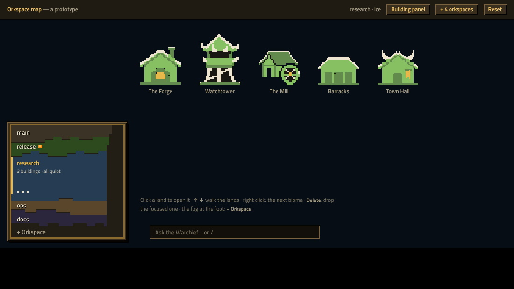
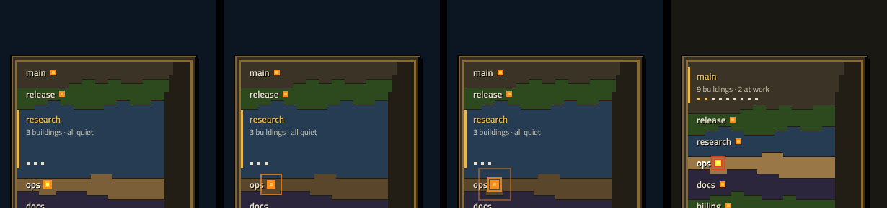
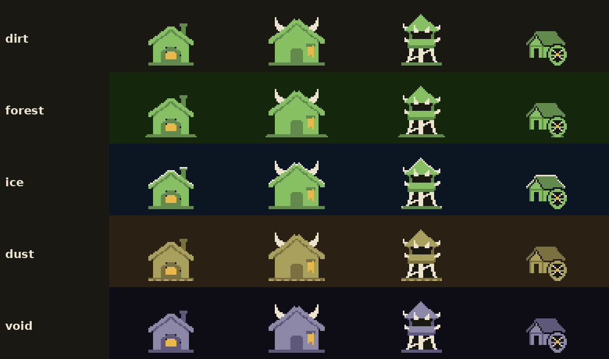
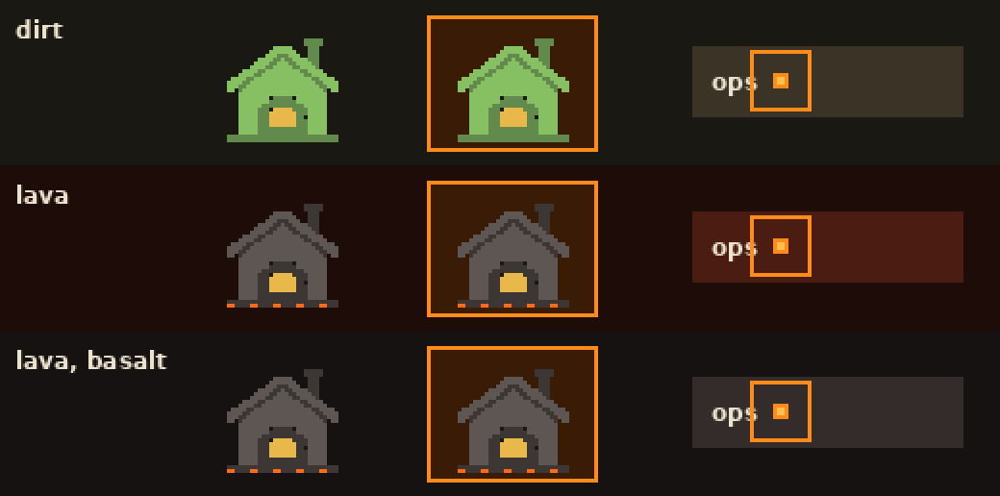

# Design — the War Map: the orkspaces as a framed map, and the biomes back

Status: design notes, written 2026-10-06; stages 1–4 are in the GUI (`js/warmap.js`, `realm/biomes.py`,
`gui/growth.py`, the huts by `tools/growth_sprites.py`). The first prototype is still
`design-system/previews/OrkspaceMap.html`. Open it in a browser: click, ↑ / ↓, right click for the
next biome (the GUI will have a menu, §2.4), Delete, the fog for `+ Orkspace`, "+ 4 orkspaces",
"Building panel". Builds on the
orkspaces of the Town Scroll (`scroll.py` `Orkspace`: `id`, `name`, `biome`, `hotkey`, `buildings`), the
calm town (calm-town.md §1: the orkspaces at the bottom left) and the flat sprites
(building-sprites.md). Wording: ork, orkestration (CLAUDE.md).

| stage | what | state |
|---|---|---|
| 1 | the biomes: six grounds, the huts drawn for each (§3) | done |
| 2 | the War Map: the orkspaces as lands in a framed square, the open one large (§2) | done |
| 3 | the map's fog at the foot makes a new orkspace; right click changes a land's biome (§2.4) | done |
| 4 | "under attack": the map calls you to another orkspace (§2.5) | done |
| later | the biome's doodads on the town's ground (sprites.md, Decorations) | |



## As built

- **A 160 px square** (40 × 40 cells of 4 px), not 240: at 240 it took too much of the town and its
  edges looked rough. The lands are even stripes: straight borders, and each land 2 cells shorter
  than the one above it (14 at most), so the right edge is a neat terrace (the wandering borders read
  as dirt at this size). A closed land is at least 28 px tall (the open one 48 px). The map is always
  square: up to four lands fit it; from five they scroll inside the frame (it used to grow to 212 px for
  six, which made it tall and narrow).
- **A new land picks its ground.** The fog's field takes its name and, under it, a row of the seven
  biomes' swatches, the suggested one lit (the first nobody has); a click or ← / → (before typing)
  picks another, Enter raises it (`orkspace.new` takes `biome`).
- **The brand's words:** *orkspace* and *War Map*, never *workspace* and *Workspaces*.
- **Terraces, not a coast.** Each land is a step (8 px) shorter than the one above it, the fog of war
  filling the wedge at the right: the ragged coast read as untidy.
- **A title and a foot.** "War Map" heads the frame, "Add orkspace +" is the
  fog's label; the title and the lands' names are in Pixelify Sans (OFL, `design-system/fonts/`, with
  Cyrillic for names people give in Russian).
- **Names are white** (the ink) on every land, the open one too: a dark or gold name does not read on
  six grounds. The open land is told by its gold bar, its height and its status line.
- **The call** rings for a new question in an orkspace that is not open, at most once in 30 s a land,
  never in quiet hours; failures do not call yet (the snapshot has no failures per orkspace).
- **The old default** is spread once per camp (`realm/biomes.settle`, marked `meta.biomes`): the first
  orkspace on "forest" becomes dirt (today's look), the others take the free biomes; biomes chosen on
  purpose stay (§6, the recommended way).
- **Rename, Biome, Remove** are the land's right click (`orkspace.rename`, `orkspace.biome`,
  `orkspace.remove`; a land with buildings is not removed).

## 1. Why

The orkspaces are a row of buttons today (`js/chrome.js` `Orkspaces`). They work, but they are the
one part of the town that says nothing of the game it is, and every orkspace looks the same once
opened: only its name tells where you are.

Two changes, one idea:

- **Each orkspace has a biome again**: its own ground, and huts drawn for it. You know which one is
  open at a glance, before you read a name.
- **The orkspaces are a map**: lands stacked in a framed square at the bottom left, where a strategy
  game keeps its minimap. Each land is coloured by its biome, so their edges need no help.

The GUI has one look (gui-design-system.md) and one vocabulary (`lexicon.TERMS`); all of this is drawn
and said in it.

## 2. The War Map

### 2.1 The shape

```
┌────────────────────────────┐   a bevelled frame (--panel-raised, --bevel-*, a --frame line)
│ main                    ░░ │   a closed land: one line, its name
│ release ■               ░░ │   ■ the orks ask a question there
│▌research                ░░ │   the open land: tall, its name in gold, a gold bar at its left,
│ 3 buildings · all quiet ░░ │     a status line,
│ ■ ■ ■                   ░░ │     and its buildings as dots (gold: at work)
│ ops                     ░░ │
│ docs                    ░░ │
│ + Orkspace ░░░░░░░░░░░░░░░ │   the fog of war: the foot (makes a new one) and a ragged edge at the right
└────────────────────────────┘
```

- **A square of 240 px** (40 × 40 cells of 6 px) in a frame of the design system's bevel. It does not
  grow with the orkspaces: they share it.
- **One land per orkspace, top to bottom** in the Town Scroll's order. It is the same list as today,
  so names read, order is kept and the keyboard walks it, but drawn as a map.
- **The open land is large**, about 2.4 closed ones: name, a status line ("9 buildings · 2 at work",
  "· 1 question", "· 1 paused" in the warning colour, "· all quiet" only when nothing waits) and a dot per building (gold while it works). The others are one
  line each.
- **Large is the open one, never the busy one.** Sizing by activity would reshape the map every time an
  ork starts or stops: it would breathe and be hard to hit. Activity shows inside a land (the status,
  the dots, ■).
- **The fog of war**: the foot of the map (`+ Orkspace`, fixed, 4 cells) and a ragged strip at the
  right (2–5 cells) where the lands end in a coast short of the frame, so the map reads as a land
  that goes on, not a table in a box. The right strip is not clickable. Only the foot makes a new
  orkspace, so it is clear where to press.

### 2.2 Borders, coast, stability

- **A border between two lands** is a straight line. (It used to wander ±1 cell, seeded by the pair of
  ids it parted; at 160 px that read as dirt, not as a map.)
- **The coast** is a terrace: each land 2 cells shorter than the one above it, at most 14 cells in;
  the fog fills the wedge on the right.
- **A seam of 1 px** (the frame's dark) parts two lands; the biome colours do the rest.
- **The heights**: the open land gets what the closed ones (≥ 5 cells, 30 px) and the fog leave, and at least 11 cells. Up to **four orkspaces** fit the square.
  From five (the Town Scroll allows eight, F1–F8) the lands scroll inside the frame, and the open
  one is kept in sight.

### 2.3 The parts, in code

- Each land is a real `<button>` the size of the square, cut to its land by `clip-path: path(…)`: a
  union of the land's cells, row by row. Clicks and hover follow the shape, so a neighbour's tooth
  clicks as the neighbour. The prototype checks this.
- **Focus** is drawn inside (a lighter land, the name dotted-underlined in gold), because a clip
  path cuts an outline off. ↑ / ↓ walk the lands and the fog, Enter opens.
- **aria-label** says what the shape shows: "release, 5 buildings, 1 question, forest";
  `aria-current` marks the open one; the map is a `nav` "Orkspaces".
- The shape is computed on the client from what the host sends. `state.orkspaces` already sends `id`,
  `name`, `biome`, `buildings` and `questions`; it adds the **working** count per orkspace.
- **One animation only**: a short (150–200 ms) change of heights when another land opens. A clip path
  morphs only between paths of the same commands, so it is done as a quick cross-fade of the two
  renders. Nothing else moves; ■ blinks as a hut's fire does.
- `js/chrome.js` `Orkspaces` is replaced by the map; its commands stay (`orkspace.select`,
  `orkspace.new`).

### 2.4 Acts

| on | does |
|---|---|
| a land | opens that orkspace (`orkspace.select`) |
| the fog at the foot | `+ Orkspace`: asks a name, as today (`orkspace.new`); the new land rises from the fog, open |
| right click on a land | its menu: Rename…, Biome ▸ (five), Delete… |
| ↑ / ↓, Enter | walk, open |
| F1–F8 | as today, the hotkeys of the orkspaces |

- **One orkspace**: a single land fills the map above the fog. It is a map from the first day, and
  the fog shows where it grows.

### 2.5 Under attack



When something new needs the operator in an orkspace **other than the open one**, the map calls, as
a strategy game's minimap does when your units are attacked:

- **Rings** of 2 px leave the land's ■ and widen in six steps (8 → 60 px, 0.9 s), three of them
  0.45 s apart; the land flashes four times. Then it rests: the ■ stays and blinks as a hut's fire
  does.
- **What calls**: a new question of an ork there (`--alert`, orange), a failed or escalated run
  (`--alert-hot`, red). Nothing else: no finished work, no carts, no growth.
- **Out of sight** (the map scrolled, §2.2): an arrow at the frame's edge, "▼ ops", blinks instead.
- **Once per event**, never again for the same question. At most one call per land in 30 s; a burst
  of questions is one call.
- **Never for the open orkspace**: there the hut's own fire already says it.
- **Quiet hours** (`realm/awake.py`): no rings, only the steady ■; the operator is asleep and the
  orks wait.
- `prefers-reduced-motion`: no rings, a steady brighter land.
- **No sound** by default. A short horn ("Your orks are under attack") could be a Settings switch,
  off unless turned on.

The prototype's "Attack: a question" and "Attack: a failure" buttons play it.

## 3. The biomes



### 3.1 Five, lava and meadow

| biome | the town's ground | the land on the map | the huts |
|---|---|---|---|
| **dirt** | `#1a1813` (today's Office ground) | `#3a3326` | as drawn |
| **forest** | `#101a0b` | `#22341a` | as drawn (the ground says forest; moss at the foot was tried and does not read) |
| **ice** | `#070d14` | `#1c2c3c` | snow: the two top pixels of every edge that faces the sky go ivory |
| **dust** | `#2a2014` | `#5a462a` | the greens dry to olive (`#a8a05c`, `#7a7040`), sand drifts along the foot |
| **void** | `#0e0c14` | `#2c263c` | the greens go ashen violet (`#8e88a8`, `#5e587a`) |
| **lava** | `#161212` | `#342c2a` | basalt, embers at the foot (§3.4) |
| **meadow** | `#0d1a16` | `#24443a` | spring green with a turn to teal (not forest's), daisies at the foot; glyphs `· , ʷ ✿` — the knights' open field |

- **One flat colour per biome**, dark and low in saturation, as sprites.md has it: the cards, their
  text, the gold and the fire must read on all five.
- These become tokens (`tokens.json`: `ground-<biome>`, `land-<biome>`), and the GUI sets `--canvas`
  from the open orkspace's biome.

### 3.1.1 The ground's glyphs, as in the TUI

The ground is not bare: as the TUI drew it (`theme.py` `terrain_glyph`), about one cell in eleven of a
13 px monospace grid carries a glyph, in one colour a step off the ground (`js/terrain.js`). It is drawn
once per biome on a 480 × 432 px canvas tile and repeats under the town, scrolling with it. Forest and ice
take the TUI's own glyphs and colours (forest `· , " ↟` in `#1f3823`, ice `· ' * ⁕` in `#162736`); the
GUI's new biomes get their own (dirt `· . \` °`, dust `· ~ ∴ ˜`, lava `· ^ ∴ ⁘`, all near their ground);
void stays bare, as in the TUI. It reads as texture, never as something to look at: cards, gold and fire
stay the only things that do. This replaces sprites.md's "one flat colour, no texture" for the GUI.

### 3.2 The huts, by code

The 19 buildings are **not redrawn** per biome. `tools/biomes.py` makes the four variants from each
flat sprite: a palette swap (dust, void) and a few pixels added by rule (snow on ice, sand on dust).
It writes `design-system/sprites/buildings/<type>/header-<biome>.png` (and `@2x`) beside today's
`header.png`, which stays dirt's and forest's. That is 76 files (95 with lava), all made by the script, so they are
clean pixels; a CSS filter at run time would smear the palette. `js/icons.js` `headerSprite(type,
biome)` picks the file. The prototype does the same on a canvas, to try the rules live.

- The agents' heads and the Warchief stay green in every biome: they are the clan, not the place.
- Void takes the green off the buildings. That is accepted: the clan stays green.

### 3.4 Lava, a sixth



Lava can be a sixth biome, **on one condition: it is never red.** Red and orange are the fire's: a
burning hut's card (`--fire-ground`), its glow, the ■ and the rings of §2.5. On a red ground (the
middle row) a burning hut barely differs from a quiet one, and the call weakens. So lava is
**basalt**:

| | |
|---|---|
| the town's ground | `#161212`, a cold near-black |
| the land on the map | `#342c2a` |
| the huts | the greens to basalt greys (`#5e5652`, `#3c3634`); a dull ember (`#8a2a10`, darker than any alert) in every sixth pair of pixels along the foot |

It reads as volcanic by the grey stone and the embers, and leaves the colour of fire to fire. With
six biomes, §3.3's "any but its neighbour's" has five to choose from. The prototype has it.

### 3.3 Who picks it

**Each kin has a home** (`realm/biomes.py` `HOMES`): orks dirt, knights meadow, elves forest, the undead
ice, goblins dust, skeletons void, gnomes lava. The kin is the onboarding's role (`realm/intents.py`), so a
new camp's first orkspace opens on the operator's home ground (`biomes.settle(scroll, home)`; a camp
settled before keeps its lands), and in Settings the mascot stands on its home: the biome's colour and
glyphs, its land as the ground line (`js/settings.js` `You`).


- A **new orkspace** gets the first biome no orkspace has. When all five are taken, it gets any biome
  but its upper neighbour's, so two lands that touch never share a colour.
- **Right click → Biome ▸** changes it. It is stored in the Town Scroll, `orkspaces[].biome`, which
  exists already (`scroll.BIOMES = ("void", "forest", "ice")`; it gains `"dirt"`, `"dust"` and `"lava"`).

## 4. With the growth of buildings

growth.md puts a flag on a hut's roof. On **ice** an ivory flag (levels I–II) disappears into the
snow, so on ice the flag's cloth gets a 1 px dark edge. The gold of III reads everywhere.

## 5. To check (in the prototype first)

| | why | how |
|---|---|---|
| the fire on **dust** and **lava** | a warm or dark ground under orange fire | a burning hut and ■ on those lands |
| the call (§2.5) | loud enough to see, calm enough to keep | "Attack: …" in the prototype, with a building panel open |
| a flag on **ice** | ivory on snow (§4) | a level I flag on an ice roof |
| the map beside an open panel | the panel takes the town's right half | "Building panel" in the prototype: the map keeps its corner and the town's huts move left |
| five to eight orkspaces | the scroll inside the frame | "+ 4 orkspaces" |
| one orkspace | the map from the first day | Delete down to one |

## 6. Open questions

- **The default biome.** `new_orkspace` writes `"forest"` when none is given, so every camp so far
  says forest, although the GUI showed them on dirt. Either the GUI's first release reads a stored
  `"forest"` as it is (the towns turn green), or a one-time step re-biomes the camp's orkspaces by
  §3.3. The second keeps today's look for the first orkspace and spreads the rest. Recommended.
- **The old War Map preview** (`design-system/previews/WarMap.html`) shows the list of the TUI's days.
  It is replaced by `OrkspaceMap.html` when the map lands.
- **Biome doodads** (a pine, a dead tree, a drift; sprites.md, Decorations) would make the five
  grounds richer. Later, and only if the town stays calm.
